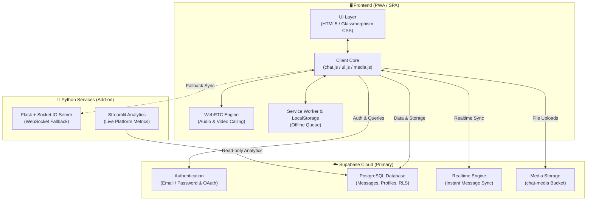

<div align="center">

# ⚡ Socket-Sync Online

**A Modern, Real-Time Communication Platform with WebRTC Calling, Rich Media Sharing & Live Analytics**

[](LICENSE)
[](https://python.org)
[](https://supabase.com)
[](https://streamlit.io)
[](#-progressive-web-app-pwa)
[](https://vercel.com)

<p align="center">
  <a href="#-key-features">Features</a> •
  <a href="#-architecture--tech-stack">Architecture</a> •
  <a href="#-project-structure">Project Structure</a> •
  <a href="#-getting-started">Getting Started</a> •
  <a href="#-database-setup">Database Setup</a> •
  <a href="#-analytics-dashboard">Analytics</a> •
  <a href="#-deployment">Deployment</a> •
  <a href="#-keyboard-shortcuts">Shortcuts</a>
</p>

---

</div>

## 📖 Overview

**Socket-Sync Online** is a full-featured, responsive, real-time messaging and peer-to-peer calling web application. Built with a modern glassmorphic interface, it combines instant messaging, WebRTC-powered HD audio/video calls, multimedia sharing, offline message queuing, and an interactive Streamlit data analytics suite.

Whether deployed as a serverless SPA on **Vercel** with **Supabase**, or run with a dedicated **Flask + Eventlet** Python backend, Socket-Sync delivers low latency, robust data persistence with Row-Level Security (RLS), and an installable Progressive Web App (PWA) experience.

---

## ✨ Key Features

### 💬 Real-Time Messaging
* **Instant Delivery**: Ultra-low latency communication via Supabase Realtime Channels / WebSockets.
* **Message Receipts**: Visual indicators for `sent`, `delivered`, and `read` statuses.
* **Revoke & Delete**: Delete messages for everyone or locally for yourself.
* **Typing Indicators**: Real-time typing status broadcasts.
* **Offline Queue**: Messages composed while offline are stored in `localStorage` and automatically synchronized when connection is restored.
* **Unread Counters**: Dynamic badge notifications per conversation.

### 📞 WebRTC Audio & Video Calling
* **Peer-to-Peer Communication**: High-definition, low-latency audio and video calls directly between browsers.
* **Call Controls**: In-call toggle for microphone mute/unmute, camera enable/disable, and full-screen mode.
* **Audio Ringers**: Incoming call alerts with ringtone and interactive accept/decline overlay.

### 📁 Rich Media & File Sharing
* **Voice Notes**: Built-in voice recorder with direct audio playback.
* **Media Uploads**: Seamless sharing of images, videos, audio clips, and documents.
* **Camera Capture**: Integrated camera modal for snapping and sending photos on the fly.
* **File Previews**: In-chat previews for images, video player, and file download cards.

### 📊 Live Analytics Dashboard
* **Powered by Streamlit**: Comprehensive metrics dashboard for platform administrators.
* **Key Visualizations**:
  * Total users, active chats, total message counts, and media exchange rates.
  * Message volume trends over time (Hourly, Daily, Monthly).
  * User activity leaderboard and engagement metrics.
  * Media type distribution breakdowns (Text, Images, Audio, Documents).

### 📱 Progressive Web App (PWA) & UX
* **PWA Enabled**: Installable on Android, iOS, Windows, and macOS with offline caching via `sw.js`.
* **Dark / Light Modes**: Adaptive aesthetic design with sleek glassmorphism and smooth micro-animations.
* **QR Code Sharing**: Quick pairing and contact discovery with custom QR codes.
* **Quick Keyboard Navigation**: Full suite of hotkeys for power users.

---

## 🏛️ Architecture & Tech Stack



### Technology Breakdown

| Component | Technologies Used |
| :--- | :--- |
| **Frontend UI** | HTML5, Modern CSS3 (Glassmorphism, CSS Variables, Flexbox/Grid), JavaScript (ES6+) |
| **Realtime & Calling** | Supabase Realtime Channels, WebRTC (RTCPeerConnection), Socket.IO (Eventlet) |
| **Database & Auth** | Supabase (PostgreSQL with RLS), Firebase Realtime DB (Legacy fallback) |
| **Storage** | Supabase Storage (`chat-media` bucket) / Local file storage |
| **Analytics** | Streamlit, Pandas, Matplotlib, Altair, NumPy |
| **Server Runtime** | Python 3.9+, Flask, Flask-SocketIO, Gunicorn, Eventlet |
| **Deployment** | Vercel (Frontend), Heroku / Render / Railway (Backend), Streamlit Community Cloud |

---

## 📁 Project Structure

```
Socket-Sync-online/
├── analytics/
│   └── dashboard.py          # Streamlit analytics dashboard app
├── backend/
│   ├── database.py           # Database abstraction layer (Firebase/Supabase)
│   └── server.py             # Flask + Flask-SocketIO backend server
├── frontend/
│   ├── css/                  # Styling & themes (glassmorphism, dark/light)
│   ├── js/
│   │   ├── modules/
│   │   │   ├── file-handler.js    # File upload and blob conversion
│   │   │   ├── socket-client.js   # Realtime message listener & dispatcher
│   │   │   ├── supabase-client.js # Supabase client initialization
│   │   │   └── ui-renderer.js     # DOM message builder and renderers
│   │   ├── call.js           # WebRTC peer-to-peer audio/video calling logic
│   │   ├── chat.js           # Main chat orchestration & state management
│   │   ├── globals.js        # Global variables and DOM element references
│   │   ├── keyboard.js       # Keyboard shortcuts & modal listeners
│   │   ├── login.js          # Authentication handlers for login
│   │   ├── media.js          # Voice recording & camera snapshot capture
│   │   ├── signup.js         # User registration logic
│   │   ├── typing.js         # Typing indicator triggers
│   │   ├── ui.js             # Theme switching, toasts, and UI interactions
│   │   └── utils.js          # Formatting helpers, time utils, sanitization
│   ├── pages/
│   │   ├── chat.html         # Main chat & calling interface
│   │   ├── login.html        # Login & OAuth landing page
│   │   ├── signup.html       # Account creation page
│   │   └── oauth-callback.html # OAuth provider redirection handler
│   ├── material/             # Icons, sounds, and UI assets
│   ├── manifest.json         # PWA web app manifest
│   └── sw.js                 # PWA service worker for offline caching
├── uploads/                  # Local media uploads directory
├── Procfile                  # Heroku/Render process deployment configuration
├── requirements.txt          # Python dependencies
├── run_dashboard.bat         # Windows launcher for Streamlit analytics
├── supabase_schema.sql       # Database table definitions & RLS policies
└── vercel.json               # Vercel serverless frontend routing configuration
```

---

## 🚀 Getting Started

### 1. Prerequisites

Make sure you have the following installed:
* [Python 3.9+](https://www.python.org/downloads/)
* [Git](https://git-scm.com/)
* A free [Supabase](https://supabase.com) account (for Database, Auth & Realtime)

### 2. Clone the Repository

```bash
git clone https://github.com/Chaudhary-Kaushal-195/Socket-Sync-online.git
cd Socket-Sync-online
```

### 3. Create & Activate Virtual Environment

```bash
# Windows
python -m venv venv
venv\Scripts\activate

# macOS / Linux
python3 -m venv venv
source venv/bin/activate
```

### 4. Install Dependencies

```bash
pip install -r requirements.txt
```

---

## 🗄️ Database Setup

Socket-Sync uses **Supabase** for PostgreSQL data storage, authentication, and realtime subscriptions.

1. Create a new project in your [Supabase Dashboard](https://app.supabase.com).
2. Navigate to the **SQL Editor** tab in Supabase.
3. Open [`supabase_schema.sql`](file:///d:/GitHub/Socket-Sync-online/supabase_schema.sql) and copy its contents into the SQL Editor.
4. Click **Run** to execute the script. This creates:
   - `profiles` table (User information & avatars)
   - `contacts` table (User connections)
   - `messages` table (Chats, media links, read statuses)
   - `chat-media` public storage bucket
   - Row-Level Security (RLS) policies
5. Copy your **Supabase URL** and **Anon Key** from `Project Settings > API`.
6. Update your credentials in [`frontend/js/modules/supabase-client.js`](file:///d:/GitHub/Socket-Sync-online/frontend/js/modules/supabase-client.js) or configure environment variables.

---

## 💻 Running Locally

### Option A: Running the Full Flask Application

The Flask server serves both the frontend static assets and handles backend WebSocket fallback events:

```bash
# Run server from root or backend directory
python backend/server.py
```
Visit `http://localhost:5000` in your web browser.

### Option B: Running the Streamlit Analytics Dashboard

Launch the interactive analytics dashboard to view live platform metrics:

```bash
# On Windows, you can double click run_dashboard.bat or run:
streamlit run analytics/dashboard.py
```
The dashboard will open automatically at `http://localhost:8501`.

---

## 📊 Analytics Dashboard

The analytics dashboard provides comprehensive real-time insights into your chat application:

* **📈 Metric Cards**: Active user count, message volume, media exchange ratios.
* **🕒 Time-Series Analysis**: Peak usage hours, daily message traffic graphs.
* **👥 User Engagement**: Top active users, conversation pairing matrices.
* **📁 Media Breakdown**: Proportions of text vs. voice notes vs. images and documents.

---

## ⌨️ Keyboard Shortcuts

Power up your workflow with built-in hotkeys:

| Key Combination | Action |
| :--- | :--- |
| <kbd>Enter</kbd> | Send current message |
| <kbd>Shift</kbd> + <kbd>Enter</kbd> | Insert a new line in input box |
| <kbd>Ctrl</kbd> + <kbd>K</kbd> / <kbd>Cmd</kbd> + <kbd>K</kbd> | Focus global search / Find user |
| <kbd>Esc</kbd> | Close active modal (Camera, Media, Profile, Call) |
| <kbd>Ctrl</kbd> + <kbd>U</kbd> | Open file attachment picker |
| <kbd>Ctrl</kbd> + <kbd>M</kbd> | Open audio recording modal |

---

## 🌐 Deployment

### Deploying Frontend to Vercel

The repository includes a ready-to-use [`vercel.json`](file:///d:/GitHub/Socket-Sync-online/vercel.json) configuring client-side routing.

1. Install the Vercel CLI: `npm i -g vercel` or connect via the [Vercel Dashboard](https://vercel.com).
2. Deploy the repository:
   ```bash
   vercel
   ```
3. Your app is live with automatic SSL and global CDN distribution!

### Deploying Backend to Render / Heroku / Railway

The [`Procfile`](file:///d:/GitHub/Socket-Sync-online/Procfile) is pre-configured with Gunicorn and Eventlet:

```procfile
web: cd backend && gunicorn --worker-class eventlet -w 1 --bind 0.0.0.0:$PORT server:app
```

1. Create a new Web Service on [Render](https://render.com) or [Heroku](https://heroku.com).
2. Set Environment to **Python 3**.
3. Set the build command to `pip install -r requirements.txt`.
4. Deploy the service.

---

## 📱 Progressive Web App (PWA)

Socket-Sync is PWA-ready out of the box:
* **Offline Fallback**: Service Worker caches app shell (HTML, CSS, JS, icons).
* **Installable**: Supports "Add to Home Screen" on mobile devices and "Install App" on desktop browsers (Chrome, Edge, Safari).
* **Native Feel**: Standalone display mode with custom theme colors and icons defined in `manifest.json`.

---

## 🤝 Contributing

Contributions are always welcome! If you'd like to improve Socket-Sync:

1. **Fork** the repository.
2. **Create a feature branch**:
   ```bash
   git checkout -b feature/AmazingFeature
   ```
3. **Commit your changes**:
   ```bash
   git commit -m "Add some AmazingFeature"
   ```
4. **Push to the branch**:
   ```bash
   git push origin feature/AmazingFeature
   ```
5. **Open a Pull Request**.

---

## 📄 License

This project is **Proprietary** and protected by copyright law. All rights reserved by **Kaushal Chaudhary**. No part of this code may be copied, modified, distributed, or used without prior written authorization. See [LICENSE](LICENSE) for details.

---

<div align="center">
  <sub>Built with ❤️ by Kaushal Chaudhary.</sub>
</div>
